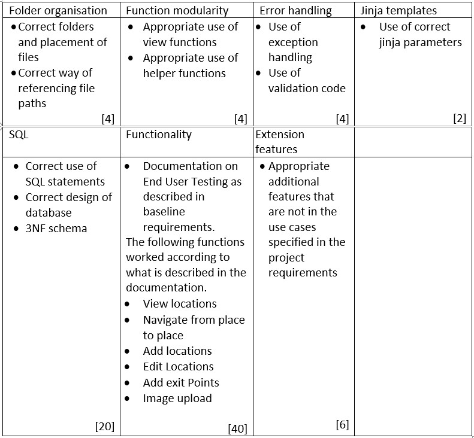
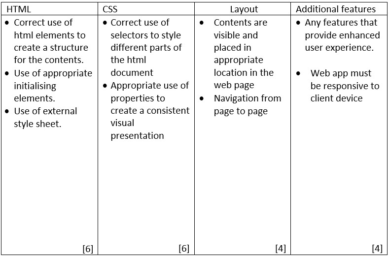

# H2 Computing Web App Project

## Table of Contents

- [H2 Computing Web App Project](#h2-computing-web-app-project)
  - [Table of Contents](#table-of-contents)
- [Assessment Information](#assessment-information)
- [Problem Statement](#problem-statement)
- [Project Requrements](#project-requrements)
  - [Visitor Use Case:](#visitor-use-case)
  - [Web Administrator Use Case:](#web-administrator-use-case)
  - [Baseline Requirements](#baseline-requirements)
  - [About The Project](#about-the-project)
    - [Marking Rubricks](#marking-rubricks)
      - [Backend Rubricks](#backend-rubricks)
      - [Frontend Rubricks](#frontend-rubricks)
    - [Built With](#built-with)
  - [Getting Started](#getting-started)
    - [Prerequisites](#prerequisites)
    - [Installation](#installation)
  - [Contributing](#contributing)
  - [License](#license)
  - [Acknowledgements](#acknowledgements)
  
# Assessment Information
Due on: Term 3B Week 6, 4 Sep 2020\
Assessment weightage (12%)

# Problem Statement
When new students and staff join the school, they will not be familiar with the various rooms and facilities in the campus. They will also not be able to navigate from one place to another. The school will usually include a tour of the campus compound during student and staff orientation programme.  The objective of the project is to build a web application that will allow a virtual tour of the campus to be conducted anytime.

# Project Requrements
## Visitor Use Case:
The web app will include a landing page where visitors will be able to view a list of locations and select one of these locations to begin the virtual tour. The starting location must be easily identified and accessible to the visitors when they entered the school campus. The locations cab be indoor or outdoor.
After a location is selected, the web app will display a more detail description of the room and at least one image of the location. There will also be a list of exit points that will allow the visitor to navigate to another location.

## Web Administrator Use Case:
The web app will allow the web site administrator to create new locations to be added to the list of existing locations. After the new location is added, the administrator will need to update the location with the exit points so that the user can navigate to another location. Other locations must also be updated with exit points that can lead them to the new location.
## Baseline Requirements
* Minimum 3 locations
*	Each location must have at least 1 exit point that will link it to the next location.
*	Each location must include at least 1 image.
*	Produce a document for end user testing giving a detail walk through on how to test all the functionalities of your web app.

Example:  Walkthrough for Adding a new location
1.	Click on the Manage Locations menu item
2.	Enter the respective data for new location in the form
3.	Select and upload an image file
4.	Click Submit

## About The Project
### Marking Rubricks
#### Backend Rubricks

#### Frontend Rubricks

### Built With

- [Bulma](https://bulma.io/)
- [Flask](https://flask.palletsprojects.com/)

## Getting Started

### Prerequisites

### Installation

## Contributing

Contributions are what make the open source community such an amazing place to be learn, inspire, and create. Any contributions you make are **greatly appreciated**.

1. Fork the Project
2. Create your Feature Branch (`git checkout -b feature/AmazingFeature`)
3. Commit your Changes (`git commit -m 'Add some AmazingFeature'`)
4. Push to the Branch (`git push origin feature/AmazingFeature`)
5. Open a Pull Request

## License

- **[GNU GPL V3 license](https://www.gnu.org/licenses/gpl-3.0.en.html)**
- Copyright 2020 © [Sim Shang En](https://github.com/12458)

## Acknowledgements

- [Bulma](https://bulma.io/)